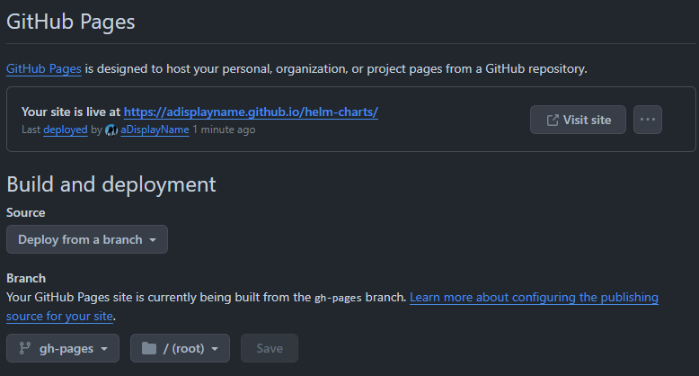

Host Helm Chart repository using github pages
=
# Overview
We are going to use the [`helm/chart-releaser-action`](https://github.com/helm/chart-releaser-action) to manage a helm chart repoistory. 

# Setup Helm Chart Repository
## Create a new repository
1. Create a new repository under your GitHub account, with the name `helm-charts`
## Enable GitHub Page
1. Create a branch named `gh-pages` in GitHub repository `helm-charts`
1. Create a folder `/charts` in `gh-pages` branch.
1. Create an initial `index.yaml` with following content:
   ```yaml
   apiVersion: v1
   entries: {}
   ```
1. Enable the GitHub Page for this new repository &rarr; `Settings` &rarr; `Pages`:
   * Set `Source` to `Deploy from a branch`
   * Set `Branch` to `gh-pages` served from on `/(root)`
   
1. Once enabled, the github page will be published by GitHub Page Action. 
1. Open a web browser and try to navigate to the following location: https://adisplayname.github.io/helm-charts/charts/index.yaml. Wait until the page can be correctly opened.

## Connect to Helm Charts
1. Use the following CLI to connect to the helm chart repository:
   ```
   helm repo add adn https://adisplayname.github.io/helm-charts/charts
   ```
   > There should not be any error message when executing the command above.
